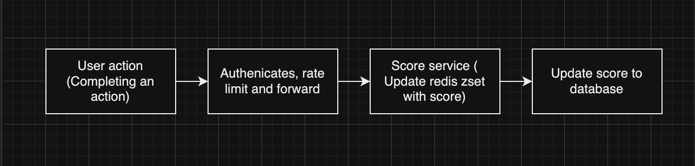

# Score Board API Module

## Overview

This module handles the score updates for users and ensures that the top 10 user scores are updated in real-time on the website's scoreboard. The module includes security measures to prevent unauthorized score manipulations.

## Features

1. **Live Update of Score Board**: Ensures that the top 10 user scores are updated in real-time.
2. **Secure Score Update**: Only authorized actions can update the user's score.
3. **Efficient Data Handling**: Optimized to handle frequent score updates without performance degradation.
4. **Use Redis ZSet**: Utilizes Redis Sorted Sets (ZSet) to efficiently manage and query the top 10 user scores.
5. **Rate Limiting**: Implements rate limiting to prevent abuse and ensure fair usage by limiting the number of score updates a user can perform in a given time frame.

## API Endpoints

### 1. Update User Score

**Endpoint**: `/api/score`

**Method**: `POST`

**Description**: Updates the user's score upon completion of an action with authentication.

**Request Body**:

```json
{
  "score": "number"
}
```

**Response**:

- **200 OK**: Score updated successfully.
- **401 Unauthorized**: Invalid authentication token.
- **400 Bad Request**: Invalid input data.

### 2. Get Top 10 Scores

**Endpoint**: `/api/score/top`

**Method**: `GET`

**Description**: Retrieves the top 10 user scores.

**Response**:

```json
[
  {
    "userId": "string",
    "score": "number"
  }
]
```

## Execution Flow Diagram



### Detailed Execution Flow

1. **User Action**: A user completes an action that triggers a score increment.
2. **API Gateway**: The client application sends a POST request to the `/api/score` endpoint with authentication token, and the score increment value.
3. **Score Service**:
   - Validates the authentication token.
   - Validates the input data (e.g., ensuring the score increment is a positive number).
   - Implements rate limiting to prevent abuse by limiting the number of score updates a user can perform in a given time frame.
   - Updates the user's score in the redis zset.
   - Updates the user's score in the database.
   - Checks if the updated score affects the top 10 scores.
4. **Score Database**: The user's new score is stored, and if it affects the top 10 scores, the score service retrieves the updated top 10 scores and notifies the client application to update the scoreboard in real-time.

## Security Considerations

1. **Authentication**: Every score update request must include a valid authentication token. Implement JWT or OAuth tokens for secure authentication.
2. **Input Validation**: Validate all inputs on the server side to prevent injection attacks and other malicious activities.
3. **Rate Limiting**: Implement rate limiting to prevent abuse by limiting the number of score updates a user can perform in a given time frame.
4. **Caching**: Use caching mechanisms (like Redis zset) to store the top 10 scores for quick access and reduce database load.

## Additional Comments and Improvements

1. **WebSocket Integration**: For real-time updates, consider integrating WebSocket to push updates to the client side instantly rather than polling the server.
